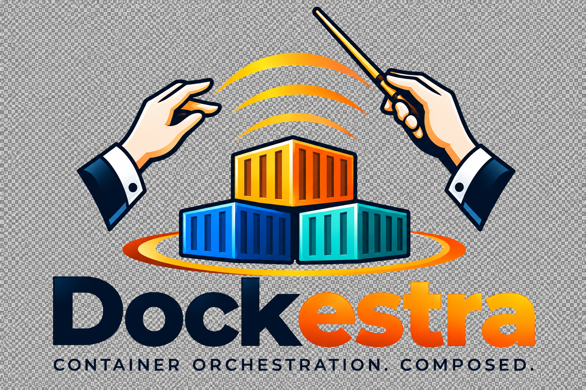

<p align="center"></p>

# rkd-dockestra-core

Python and Django backend for the Dockestra platform. The Django project is `rkd_dockestra_core`, and its application is `core`.

## Database

Na primeira inicialização após a renomeação, o container copia o SQLite persistido com o nome anterior para o novo arquivo antes de aplicar as migrações. O arquivo antigo permanece como cópia de segurança. Na execução direta de `manage.py`, o Django usa o banco antigo caso ele exista e o novo ainda não exista. Tokens GitHub já criptografados continuam legíveis com a mesma `DJANGO_SECRET_KEY`.

SQLite stores data in `rkd_dockestra_core.sqlite3` at the repository root by default. Set `DJANGO_DB_PATH` to use another location; the container uses `/data/rkd_dockestra_core.sqlite3` so a Docker volume can persist it. The `core` migrations create the `project`, `environment`, `image`, `setup`, and `instance` tables. The hierarchy is `Project → Environment → Image → Setup → Instance`; each instance has a protected `setup_id` foreign key. Migration `0003` renames the previous table to `setup` without discarding its records. Their relationships use `project_id`, `environment_id`, and `image_id`. Each table has an automatically generated `id` primary key.

## Requirements

- Python 3.12 or later
- Git CLI for images linked to a GitHub repository
- Docker CLI and a reachable daemon to create containers

## Run locally

`DJANGO_SECRET_KEY` é obrigatória em todos os ambientes, inclusive com `DJANGO_DEBUG=True`. Para executar Django diretamente, configure a variável no terminal antes dos comandos `manage.py`: no Git Bash, `export DJANGO_SECRET_KEY='<sua chave estável>'`; no PowerShell, `$env:DJANGO_SECRET_KEY='<sua chave estável>'`. Use a mesma chave em cada execução para preservar os tokens criptografados. O Django não carrega `.env` automaticamente na execução direta; no Docker, o Compose passa esse arquivo ao container.

Tokens salvos anteriormente com a antiga chave padrão de desenvolvimento precisam ser cadastrados novamente ao configurar uma nova chave. Os demais registros do banco permanecem armazenados.

From Git Bash on Windows:

```bash
python -m venv .venv
./.venv/Scripts/python.exe -m pip install -r requirements.txt
./.venv/Scripts/python.exe manage.py migrate
./.venv/Scripts/python.exe manage.py createsuperuser --username RKD
./.venv/Scripts/python.exe manage.py runserver
```

From PowerShell, use `.\.venv\Scripts\python.exe` in place of `./.venv/Scripts/python.exe`. If `.venv` already exists, skip the virtual environment creation step. Gmail host, port and TLS have defaults; enter the email address and app password in the terminal when creating the operator. Direct Django execution does not load `.env` automatically.

The initial JSON response is available at `http://127.0.0.1:8000/`.

## Testar localmente com Docker

Execute `bash scripts/refresh-local.sh` na raiz deste backend (ou `./refresh-local.sh` dentro de `scripts/`). O script faz **somente o deploy do backend**. Ele não gera nem troca `DJANGO_SECRET_KEY`: se faltar a chave no `.env`, interrompe antes de remover qualquer container e orienta executar `scripts/configure-secret-key.sh`.

Depois das verificações iniciais, remove o container antigo sem apagar volumes, constrói a imagem atual, executa os testes em um container descartável com banco em memória (sem o `.env`, banco real ou socket Docker do host), verifica se os models possuem migrations versionadas, aplica as migrations pendentes no SQLite persistido e inicia um novo backend. Não executa `makemigrations` para gerar arquivos: alterações de models devem vir acompanhadas das migrations no código. O entrypoint aceita comandos avulsos para aplicar migrations e também mantém a aplicação idempotente de migrations na inicialização normal.

Se o build, os testes ou as migrations falharem, o script encerra sem iniciar o novo backend. Como a remoção vem primeiro, o serviço fica indisponível até corrigir o erro e repetir o deploy. A chave e os arquivos do banco são preservados; migrations podem modificar a estrutura e os dados conforme seu próprio código. Faça backup antes de migrations que alterem dados. O frontend e o Nginx têm seu próprio deploy, executado separadamente em `rkd-dockestra-web/scripts/refresh-local.sh`.

O container do backend se chama `rkd-dockestra-core-local-1` neste modo e `rkd-dockestra-core-1` no Compose da VPS. Os nomes são fixados com `container_name`: o sufixo `1` faz parte do nome e não aumenta automaticamente. Essa configuração permite uma instância do serviço por ambiente. Os comandos Compose continuam usando o serviço `backend`, e a comunicação interna usa o alias `rkd-backend`.

Use Docker Desktop com **containers Linux** e Docker Compose. Você pode gerar a chave pelo **Git Bash no Windows**, com OpenSSL disponível (`openssl version`). Também pode executar o script em Ubuntu/WSL com a [integração do Docker Desktop](https://docs.docker.com/desktop/features/wsl/) habilitada. Para melhor compatibilidade de permissões e volumes, prefira os clones no sistema de arquivos Linux do WSL. Os comandos seguintes são executados na raiz do backend; depois da geração, os comandos `docker compose` também podem ser executados no PowerShell.

A ordem é: **gerar/preservar a chave no `.env` → criar o backend → informar o e-mail e a senha de app no terminal → confirmar o e-mail e criar RKD → iniciar frontend e Nginx**. Nenhum container do backend precisa existir para gerar a chave:

```bash
bash scripts/configure-secret-key.sh
# O e-mail e a senha de app serão solicitados por create-superuser.sh.
bash scripts/refresh-local.sh
bash scripts/create-superuser.sh
```

O primeiro comando só prepara o `.env` e não chama Docker. `refresh-local.sh` realiza o deploy e aplica migrations sem alterar a chave. No Windows, o script separa `docker build` de `docker compose up --no-build` para evitar erros de metadados do Compose/Bake. O cadastro é uma etapa separada; se RKD já existir, `create-superuser.sh` inicia a recuperação pelo e-mail cadastrado.

Em seguida, na raiz do frontend:

```bash
cd ../rkd-dockestra-web
bash scripts/refresh-local.sh
```

Abra **http://localhost:8080/**. O Compose local usa a rede `rkd-local-network`, criada pelo backend, e mantém a porta 8000 interna. Ele desativa Turnstile apenas nesse modo de desenvolvimento e permite os cookies de login em HTTP; não exige um widget, certificado HTTPS ou `.env` do frontend. A chave Django continua obrigatória. Os containers gerenciados pelo sistema serão criados no Docker local.

### Primeiro superusuário RKD com confirmação por e-mail

O script `scripts/create-superuser.sh` existe apenas neste backend, fixa o usuário **RKD** e executa `docker exec -it rkd-dockestra-core-local-1 python manage.py createsuperuser --username RKD`. Ele funciona a partir de qualquer diretório quando chamado pelo caminho correto. No Git Bash/mintty, utiliza `winpty` quando disponível.

O comando Django `createsuperuser` foi customizado: enquanto o banco estiver vazio, apenas **RKD** pode ser o primeiro usuário. A confirmação de e-mail também é obrigatória para superusuários posteriores criados pelo comando, inclusive ao usar `--email`. O modo `--noinput` é recusado. Se o superusuário RKD já existir, o script inicia automaticamente a recuperação de acesso: envia o código somente ao e-mail já cadastrado, aguarda sua confirmação e solicita uma nova senha. O e-mail, as permissões e os demais dados são preservados. A senha anterior deixa de funcionar e as sessões autenticadas anteriormente precisam fazer login novamente. Outros usuários existentes continuam sendo recusados por este comando.

Para enviar pelo Gmail, ative a verificação em duas etapas da conta remetente e crie uma [senha de app do Google](https://support.google.com/accounts/answer/185833?hl=pt-BR). A disponibilidade depende das políticas da conta. A senha de app será solicitada duas vezes no terminal, com digitação oculta e sem espaços. As duas entradas devem ser exatamente iguais, inclusive maiúsculas e minúsculas. Se diferirem ou contiverem espaços, ambas serão solicitadas novamente antes de enviar qualquer e-mail. Nunca informe a senha normal da conta Google. Acrescente apenas as configurações abaixo ao `.env` **do backend**, preservando a chave Django e os demais valores:

```dotenv
EMAIL_HOST=smtp.gmail.com
EMAIL_PORT=587
EMAIL_USE_TLS=True
EMAIL_USE_SSL=False
```

O e-mail informado para RKD no terminal autentica o envio SMTP e também recebe o código de confirmação. A senha de app precisa pertencer a essa mesma conta Gmail. Os padrões de host, porta e TLS já correspondem ao [SMTP do Gmail](https://support.google.com/mail/answer/7104828?hl=pt-BR). Não configure endereços ou senhas no `.env`: `EMAIL_HOST_USER`, `EMAIL_HOST_PASSWORD` e `DEFAULT_FROM_EMAIL` antigos não são mais lidos.

O e-mail e a senha de app ficam criptografados nas colunas `encrypted_email` e `encrypted_password` da tabela `smtp_credential`. O endereço de cada operador fica em `operator_email.encrypted_email`, relacionado à conta; `auth_user.email` fica vazio para não manter uma cópia em texto aberto. A criptografia autenticada Fernet usa chaves derivadas de `DJANGO_SECRET_KEY`, separadas por finalidade. Essas tabelas não são expostas na API nem na administração. As gravações ocorrem na mesma transação da conta, somente após confirmar o código e definir a senha de acesso. Falhas ou cancelamento preservam os registros anteriores.

A migration `0010_encrypted_email` converte os endereços existentes para esse formato e remove a antiga coluna SMTP `username`, preservando usuários, permissões e senhas. Na recuperação, o endereço original de RKD é decifrado do banco: não é solicitado um novo endereço e não é permitido substituí-lo. Se o remetente SMTP antigo era diferente do e-mail cadastrado de RKD, informe a senha de app da conta de RKD na próxima execução. Outros superusuários recebem a confirmação em seus próprios endereços, usando RKD como remetente.

A credencial é reutilizada nas próximas execuções. Se o Gmail recusar a senha salva, o terminal solicita uma nova senha de app. Se o endereço cadastrado não puder ser decifrado, restaure a `DJANGO_SECRET_KEY` original: a recuperação não aceita outro endereço para contornar essa falha. Bancos local e de produção possuem configurações independentes. O reset com `configure-secret-key.sh --force` também remove os endereços e a credencial, que precisarão ser informados novamente.

Depois de configurar o `.env`, execute na raiz do backend:

```bash
bash scripts/refresh-local.sh
bash scripts/create-superuser.sh
```

A reconstrução é necessária para incluir o comando atualizado na imagem, aplicar as migrations de credenciais, incluindo `0010_encrypted_email` e carregar as configurações SMTP no container. O script recusa containers antigos que ainda não suportem a credencial criptografada no banco.

Se aparecer **autenticação SMTP recusada (código 535)**, o servidor SMTP foi alcançado, mas recusou as credenciais. Informe no terminal uma senha de app válida gerada na conta Google correspondente ao e-mail cadastrado de RKD. A credencial salva recusada pode ser substituída na própria execução; se a nova também for recusada, execute `scripts/create-superuser.sh` novamente. A troca da senha de app não exige deploy. Se alterar host, porta ou TLS no `.env`, recrie o backend com `bash scripts/refresh-local.sh`. A falha de envio preserva a conta e a credencial já salvas.

Fluxo do terminal para uma conta nova:

1. Informe o e-mail de RKD. Ele será usado como remetente SMTP e destinatário da confirmação.
2. Na primeira configuração, informe `EMAIL_HOST_PASSWORD`, a senha de app dessa conta Gmail, sem espaços. Pressione Enter e digite novamente para confirmar. Ambas as digitações ficam ocultas e precisam ser idênticas.
3. Receba um código aleatório com **16 caracteres alfanuméricos**, exibido no e-mail em quatro grupos de quatro, como `a7B2-xQ9m-Z1y2-X3w4`. Os três hífens são apenas visuais.
4. Digite apenas os **16 caracteres, sem hífens nem espaços**, respeitando maiúsculas e minúsculas: para o exemplo acima, `a7B2xQ9mZ1y2X3w4`. O terminal aguarda sua entrada; a validade de **5 minutos** é conferida quando você responde. Há no máximo **3 tentativas** por execução. Ao errar três vezes ou responder após a expiração, o comando encerra e exige executar `./create-superuser.sh` novamente para receber outro código.
5. Após confirmar o e-mail, defina e repita a senha de acesso. A senha não aparece enquanto é digitada e deve passar pelos validadores do Django.
6. A conta e a credencial SMTP criptografada são salvas somente depois dessas etapas. Entre na interface com `RKD` e a senha escolhida.

Na recuperação, o terminal não solicita um novo e-mail: usa o endereço original de RKD. Mesmo `--email` não pode substituí-lo. A nova senha deve ser diferente da atual e passar pelos validadores do Django. Se RKD estiver inativo, não tiver acesso de operador/superusuário ou não possuir um e-mail válido, o comando encerra e solicita revisão administrativa; ele não promove nem reativa contas. Se a conta for alterada por outro processo durante a confirmação, a recuperação é recusada e deve ser reiniciada.

Cada execução que inicia a verificação gera um novo código com o gerador criptográfico do Python. O código fica apenas na memória daquele processo e na mensagem enviada; não é exibido no terminal, persistido no banco ou aceito por outra execução. Erro de envio, código incorreto, expiração ou cancelamento não cria usuário nem altera a senha existente. Use `Ctrl+C` para cancelar e execute novamente para receber outro código. Testes automatizados usam a caixa de e-mail em memória do Django, sem enviar mensagens reais.

O SQLite local fica em `volumes/sqlite/rkd_dockestra_core.local.sqlite3` e é preservado ao recriar o backend. Ele é separado do arquivo usado pelo Compose da VPS e do banco de desenvolvimento na raiz; por isso os usuários, credenciais SMTP e registros desses outros bancos não aparecem automaticamente. Preserve a chave original para continuar decifrando as credenciais salvas.

A pasta `volumes/` contém apenas dados gerados e é ignorada pelo Git e pelo build Docker. Não é necessário restaurá-la pelo Git antes de iniciar: o Compose cria o diretório montado e o backend cria as tabelas automaticamente. Apagar essa pasta remove o banco, incluindo usuários e cadastros; na próxima inicialização será criado um banco vazio.

Para consultar o backend local:

```bash
docker compose -f docker-compose.local.yml ps
docker compose -f docker-compose.local.yml logs -f backend
```

Use `-f docker-compose.local.yml` em todos os comandos locais do Compose. O Compose sem `-f` seleciona a configuração da VPS; `scripts/refresh-local.sh` sempre usa a configuração local e não recebe flags.

### Erro de certificado HTTPS durante o build

Se o build apresentar `curl: (60) SSL certificate problem: self-signed certificate in certificate chain`, um proxy ou antivírus pode estar assinando as conexões com uma CA que é confiável no Windows, mas está ausente na imagem Linux. Identifique o emissor da cadeia HTTPS e use apenas sua CA pública já confiável no host. Consulte o procedimento de [certificados CA no Docker](https://docs.docker.com/engine/network/ca-certs/).

No Windows, abra `certmgr.msc`, acesse **Autoridades de Certificação Raiz Confiáveis → Certificados** e exporte a CA identificada como **X.509 codificado em Base64**, sem chave privada. Salve o resultado com extensão `.crt` em `docker/certificates/` deste repositório. Não use o certificado de servidor de `download.docker.com` como CA e não desative a verificação SSL. Se o certificado estiver no armazenamento da máquina em vez do usuário, use `certlm.msc`.

O Dockerfile instala os `.crt` antes dos downloads HTTPS e o pip usa o bundle completo do sistema. Os certificados locais são ignorados pelo Git; a pasta fica vazia em um clone novo, até você adicionar a CA necessária naquele ambiente. Para reconstruir localmente, execute `docker build -t rkd-core-local-backend:latest .` e depois `docker compose -f docker-compose.local.yml up -d --no-build --wait`. O backend preserva o `.env` e o SQLite durante essa operação.

Se a mesma inspeção HTTPS atingir o frontend, copie a mesma CA para `rkd-dockestra-web/docker/certificates/`, conforme o README daquele projeto. Na VPS, só adicione uma CA extra se a rede da VPS também exigir essa confiança.

## Deploy on the Ubuntu VPS with Docker Compose

Este repositório tem seu próprio `docker-compose.yml`. Ele inicia Django e cria a rede `rkd-network`, compartilhada com o Compose do frontend. A imagem do backend inclui Git e o cliente Docker; ela usa o Docker Engine **da VPS** pelo socket `/var/run/docker.sock`, sem iniciar outro daemon. A porta 8000 permanece interna à rede Docker. O Nginx do frontend encaminha `/api/`, `/admin/` e `/static/` para o backend.

### Pré-requisitos na VPS

1. Ubuntu com acesso SSH e um usuário autorizado a executar Docker (`sudo docker ...` nos exemplos abaixo). Instale [Docker Engine, CLI e Buildx pelo repositório oficial](https://docs.docker.com/engine/install/ubuntu/) e o [plugin Docker Compose](https://docs.docker.com/compose/install/linux/) caso ainda não estejam instalados. Não é necessário instalar Python, Node.js ou Nginx diretamente no Ubuntu.
2. Git e OpenSSL instalados na VPS (`sudo apt update && sudo apt install -y git openssl`), acesso para clonar os dois repositórios e saída HTTPS para baixar imagens/dependências e consultar GitHub e Cloudflare. Se algum dos repositórios da aplicação for privado, configure sua autenticação Git para o clone; o token informado na tela de imagens serve para os repositórios de código das imagens, não para clonar estes dois projetos.
3. O domínio `sinan-pro.com` apontando para o IPv4 público da VPS. Se houver registro AAAA, ele também deve apontar para um IPv6 funcional da VPS; caso contrário, remova esse registro. Libere TCP 80 e 443 no firewall da VPS e no painel da Hostinger e deixe essas portas disponíveis para o Nginx do frontend. O Certbot usa a porta 80 para obter o certificado HTTPS. Não é preciso mudar os nameservers do domínio para a Cloudflare apenas para usar Turnstile.
4. Um [widget Cloudflare Turnstile](https://developers.cloudflare.com/turnstile/get-started/widget-management/dashboard/) criado com o hostname **`sinan-pro.com`** (sem `https://` e sem caminho). Guarde a **Site key** e a **Secret key**. O modo Managed pode ser usado. A Secret key só deve ser configurada no backend. O login de produção exige ambas as chaves.

Confirme o Docker antes de iniciar a aplicação:

```bash
sudo systemctl is-active docker
sudo docker version
sudo docker compose version
sudo docker buildx version
```

### Instalação inicial do backend

Os comandos abaixo são executados na VPS, via SSH. Clone os dois projetos no mesmo diretório pai; inicie o backend antes do frontend, pois ele cria `rkd-network`:

```bash
git clone https://github.com/madrijkaard/rkd-dockestra-core.git
git clone https://github.com/madrijkaard/rkd-dockestra-web.git
cd rkd-dockestra-core
bash scripts/configure-secret-key.sh
nano .env
sudo docker compose up -d --build
sudo docker compose ps
```

O script cria o `.env` a partir de `.env.example` se necessário e gera `DJANGO_SECRET_KEY` automaticamente. Preencha as **duas chaves Turnstile reais** no `.env`, sem os sinais `< >` dos exemplos:

```dotenv
DJANGO_SECRET_KEY=<valor_gerado_pelo_script_nao_substitua>
TURNSTILE_SITE_KEY=<site_key_do_widget>
TURNSTILE_SECRET_KEY=<secret_key_do_widget>
```

Mantenha `DJANGO_SECRET_KEY` estável: ela protege sessões e criptografa os tokens GitHub, os endereços de e-mail e a senha de app SMTP salvos. O Compose já define `DJANGO_DEBUG=False`, `DJANGO_ALLOWED_HOSTS=sinan-pro.com`, `TURNSTILE_ALLOWED_HOSTNAMES=sinan-pro.com` e `DJANGO_DB_PATH=/data/rkd_dockestra_core.sqlite3`. Não é necessário criar essas variáveis no ambiente global do Ubuntu: o `.env` é passado ao container. Não coloque chaves no frontend, no Dockerfile, no Git ou em uma imagem Docker.

Se a variável estiver ausente, vazia ou contiver apenas espaços, o backend encerra a inicialização e escreve no terminal/log uma mensagem indicando que falta configurar `DJANGO_SECRET_KEY`. Não existe chave padrão de desenvolvimento. O build usa uma chave aleatória temporária apenas para `collectstatic`; ela não é configurada como variável de ambiente da imagem nem substitui a chave obrigatória em execução.

### Script para configurar DJANGO_SECRET_KEY

`scripts/configure-secret-key.sh` cuida somente da chave e, com `--force`, do reset dos bancos. Sem opções, gera 48 bytes aleatórios com OpenSSL, salva os 96 caracteres hexadecimais em `DJANGO_SECRET_KEY` no `.env` da raiz e preserva as outras variáveis. Se já houver uma chave, não altera o arquivo. A chave nunca é exibida. O script funciona a partir de qualquer diretório quando chamado pelo caminho correto.

```bash
# Dentro de scripts/:
./configure-secret-key.sh          # gera se faltar; preserva se já existir
./configure-secret-key.sh --help   # também aceita -h
./configure-secret-key.sh --force  # NOVA CHAVE E RESET DOS BANCOS DESTE CHECKOUT
```

As antigas opções `--local` e `--generate-only` foram removidas. Sem opções, não há build, deploy, migrations ou reset de dados, mesmo se já houver bancos e faltar a chave.

**`--force` apaga os dados.** Ele gera outra chave mesmo que já exista uma, remove os containers com bind mounts dos bancos deste checkout e exclui os arquivos `*.sqlite3`, `*.sqlite3-wal`, `*.sqlite3-shm` e `*.sqlite3-journal` da raiz e de `volumes/sqlite/`. Isso inclui os bancos local, de produção, de execução direta e os nomes legados `container_core`, para impedir a restauração automática de dados antigos. Usuários (inclusive RKD), cadastros e sessões desses bancos são perdidos. As demais variáveis do `.env`, diretórios e volumes nomeados dos containers das aplicações são preservados. Não há `docker volume prune`, remoção recursiva de diretórios nem exclusão de bancos de outro checkout.

O reset exige Docker acessível para encerrar os containers que usam esses arquivos. Antes de usá-lo, encerre também qualquer Django executado diretamente no host. Links simbólicos nas pastas/arquivos de banco são recusados. Uma configuração personalizada `DJANGO_DB_PATH` no `.env` também é recusada, pois não é seguro presumir que um banco externo deve ser apagado. O banco novo e vazio será criado pelas migrations no próximo deploy; depois será necessário cadastrar RKD novamente:

```bash
./configure-secret-key.sh --force
./refresh-local.sh
./create-superuser.sh
```

O deploy normal nunca chama o gerador de chave nem executa reset. Para produção, configure a chave com o mesmo script sem opções e execute o Compose de produção separadamente: `sudo docker compose up -d --build`. Os scripts `refresh-local.sh` usam exclusivamente os Composes locais.

### Persistência e primeiro usuário

O SQLite fica em **`rkd-dockestra-core/volumes/sqlite/rkd_dockestra_core.sqlite3` na VPS**, montado como `/data/rkd_dockestra_core.sqlite3` no container. O backend cria a pasta e executa as migrations ao iniciar. O banco local de desenvolvimento e seus usuários não são enviados pelo Git. Na VPS, informe o e-mail e a senha de app no terminal durante o cadastro, conforme a seção de confirmação por e-mail. Para criar o primeiro operador no banco novo:

```bash
sudo docker compose exec backend python manage.py createsuperuser --username RKD
sudo docker compose logs --tail=100 backend
```

Depois, entre em `../rkd-dockestra-web` e siga a seção de implantação do README do frontend para configurar `ACME_EMAIL`, iniciar Nginx e Certbot e acessar `https://sinan-pro.com/`.

### Manutenção e cuidados

Faça backup de `volumes/sqlite/rkd_dockestra_core.sqlite3` **e** da `DJANGO_SECRET_KEY`, armazenando a chave separadamente. Se trocar a chave, os tokens privados, os endereços de e-mail e a senha SMTP já salvos não poderão ser descriptografados; preserve a chave junto ao backup, em armazenamento separado. Ao atualizar este projeto, execute `git pull` e `sudo docker compose up -d --build` neste diretório. Consulte `sudo docker compose ps` e `sudo docker compose logs --tail=100 backend` se o backend não ficar saudável.

O socket Docker dá ao backend controle efetivo sobre o host. Conceda acesso de operador (`staff`) somente a pessoas confiáveis e não exponha a porta 8000 publicamente.

## Backend image definition

The repository's `Dockerfile` deploys Dockestra Core itself. For a container managed by the application, save Dockerfile text in an `image` record's `definition` field, then create a setup linked to that image. Without a GitHub repository, the API builds with the backend repository root as its context. With a repository, it checks out the selected branch into a temporary directory and uses that source tree as the context. The Dockerfile can use `COPY . /app` to include the selected branch. The backend `.dockerignore` applies only when the backend repository is the context; a linked repository can supply its own `.dockerignore`.

The image form reads the repository's GitHub About description through `GET /api/github/description/` for public repositories or `POST /api/github/description/` with a token or saved image ID for private repositories. The response contains only `description`; tokens remain on the backend. An empty About field returns an empty string so the operator can enter a description manually.

For a backend image, use Python 3.12, install `requirements.txt`, include the application source, run migrations at startup, and serve `rkd_dockestra_core.wsgi:application` with Gunicorn. Set `DJANGO_DB_PATH` to a path such as `/data/rkd_dockestra_core.sqlite3`. The setup determines whether to mount a named volume at `/data` and publish a port. The image needs the Docker CLI only if it will itself call the container creation endpoint; the CLI also needs a reachable daemon and appropriate credentials at runtime.

The container API applies the setup's CPU, memory, optional port mapping, and optional named volume mount when starting a container. Replica N uses `host_port + N - 1`, retaining the configured bind IP and container port. For example, `8000:8000` gives replicas 1, 2, and 3 host ports 8000, 8001, and 8002. The mapping is stored in `instance.port`. A deleted replica number and its port offset can be reused by the next instance. An occupied port causes a creation error; ports exceeding 65535 are rejected before building. Replicas share the setup's named volume. It does not pass environment variables or Docker daemon credentials to the container. API access requires a Django staff account. Only trusted operators should receive staff access because they can define Dockerfiles and start containers.

## CRUD API

| Resource | List and create | Retrieve, update, and delete |
| --- | --- | --- |
| Projects | `GET/POST /api/projects/` | `GET/PUT/DELETE /api/projects/<id>/` |
| Environments in a project | `GET/POST /api/projects/<id>/environments/` | `GET/PUT/DELETE /api/environments/<id>/` |
| Images in an environment | `GET/POST /api/environments/<id>/images/` | `GET/PUT/DELETE /api/images/<id>/` |
| Setups using an image | `GET/POST /api/images/<id>/setups/` | `GET/PUT/DELETE /api/setups/<id>/` |
| Instances of a setup | `GET/POST /api/setups/<id>/instances/` | `GET/DELETE /api/instances/<id>/` |

`GET /api/projects/<id>/setups/` lists every setup in a project and includes its setup, image, and environment codes.

Images store optional `repository` and `branch` strings (up to 256 characters each), `isPrivate` (0 or 1), and a `token` text field. A repository URL must use `https://github.com/owner/repo`; a branch is required when a repository is set. Private images require a token with repository Contents read permission. The backend encrypts the token before writing to the database and never includes it in API responses; `hasToken` indicates whether one is saved. On update, an empty token preserves the saved token when the repository is unchanged. Switching to public clears it. Migration `0007` adds these fields to existing images.

`GET /api/github/branches/?repository=<URL>` lists public branches. `POST /api/github/branches/` with JSON `{ "repository": "...", "token": "..." }` lists private branches before saving; with `{ "repository": "...", "image_id": 1 }` it uses the saved token for that image. Credentials are sent in the request body, never in the URL. Results are cached for five minutes per credential and read up to 2,000 branches. Only authenticated staff operators can call these endpoints.

`GET /api/system/cpu/` returns the current CPU limit for containers. It reads the number of logical CPUs exposed by the Docker daemon; when Docker is unavailable, it falls back to the host's logical CPU count and identifies that source in the response.

`GET /api/system/memory/` returns the total memory available to the Docker daemon in bytes. When Docker is unavailable, it falls back to the host's total physical memory. This is the machine's capacity, not its momentary free memory.

## Docker containers

`GET /api/setups/<id>/instances/` lists the setup's successfully created instances. `POST` to the same URL builds the linked image's `definition` (Dockerfile text), starts a detached container, and persists an `instance` row. The response includes `id`, `setup_id`, `number`, `code`, `container_id`, `container_name`, `port`, and audit fields. `POST /api/setups/<id>/containers/` remains a compatible alias and also persists the instance.

Instance codes and Docker container names are exactly `<setup-code>-replica-<number>`, for example `SERVER-replica-1`. The API reserves the lowest available positive number atomically before the Docker build without holding a database transaction during the build. Pending instances also reserve their number. After deletion or a failed creation, that number can be reused. Existing containers keep their assigned names and ports; they are not renumbered automatically. Codes must form valid Docker names; duplicate names across setups return HTTP 409. Setup responses include `hasInstances`; while it is true, `PUT /api/setups/<id>/` returns HTTP 409 (`setup_has_instances`) without changing the setup. The Django Admin also refuses setup changes in this state. This includes instances still being created. Delete all registered instances before editing a setup.

`DELETE /api/instances/<id>/` forcibly stops and removes the recorded container by its Docker ID, then removes the database row. If Docker fails, the row is kept for retry. If the container was already removed externally, the row can still be deleted. Named volumes are preserved. A setup with instances cannot be deleted. Existing containers created before migration `0008` are not automatically registered because their identities were never stored. The Docker CLI must be on the Django process's `PATH`, and the Docker daemon must be running. If Docker is unavailable, the API returns HTTP 503 with `code: "docker_unavailable"`; the web app shows a notification.

The definition is passed to `docker build --file -` through standard input. If a repository is set, Git checks out the selected branch first; the token is supplied to Git through its process environment and is not sent to Docker, placed in the clone URL, or saved in `.git/config`. The temporary checkout is removed after the build. The setup's `cpu` accepts a positive number such as `2` or `0.5`, up to the current CPU limit. Its `memory` accepts a positive quantity of at least 6 MB with a unit, such as `512 MB` or `4 GB`, up to the current machine capacity. The API checks both limits when a setup is saved and again against the Docker daemon when a container starts. Optional `port` uses `host_port:container_port`, such as `8000:8000`, and binds to `127.0.0.1` by default. To choose another IPv4 bind address, use `IP:host_port:container_port`, such as `0.0.0.0:8000:8000`. Optional `volume` uses a named volume and absolute container path, such as `backend_data:/data`; host bind paths are not accepted. These values are applied with Docker's `--cpus`, `--memory`, `--publish`, and `--mount` options. Each request creates a separately named image and container. Use a stable volume name for a replacement container that should access the same SQLite database; do not run two writers against the same database at once.

Create and update requests use JSON. Send `code` and the fields specific to each resource. The backend records the logged-in operator in `created_by` and `last_modified_by`. The timestamp fields are automatic. A record with associated children cannot be deleted; the API returns HTTP 409 with `code: "associated_records"`. Delete its children first.

`GET /api/auth/session/` supplies the CSRF cookie and current operator status. `POST /api/auth/login/` accepts a staff username and password, and `POST /api/auth/logout/` ends the session. Write operations use Django's CSRF protection; clients send the `csrftoken` cookie in the `X-CSRFToken` header. The Angular development server proxies `/api/` requests to `http://127.0.0.1:8000`.

## Login CAPTCHA

The login page uses Cloudflare Turnstile when `TURNSTILE_SITE_KEY` and `TURNSTILE_SECRET_KEY` are set in the backend environment. Create a Turnstile widget for the frontend hostname in the [Cloudflare dashboard](https://dash.cloudflare.com/?to=/:account/turnstile), then set its site key and secret key on the backend process. Set `TURNSTILE_ALLOWED_HOSTNAMES` to a comma-separated list of frontend hostnames (without protocol or port), such as `app.example.com`. The backend validates the single-use challenge token with Cloudflare, checks that its action is `login`, and checks its hostname when that list is set. The secret key must never be placed in the frontend or committed to Git. The backend must be able to reach `https://challenges.cloudflare.com/turnstile/v0/siteverify`; browsers must be able to load the Turnstile script from that host.

With `DJANGO_DEBUG=False`, login requires both keys and fails closed when they are absent. With debug enabled and neither key set, local login remains available without Turnstile. Setting either key in debug mode also requires both keys and a valid challenge.

## Tests

```bash
./.venv/Scripts/python.exe manage.py test
```

For nonlocal deployments, use HTTPS and set a strong, stable `DJANGO_SECRET_KEY`, `DJANGO_DEBUG=False`, and `DJANGO_ALLOWED_HOSTS` appropriately. The secret key also encrypts saved GitHub tokens, email addresses and the SMTP app password; changing it makes existing credentials unreadable until operators replace them. Back up the key separately from the database. Session and CSRF cookies are marked secure when debug is disabled.
